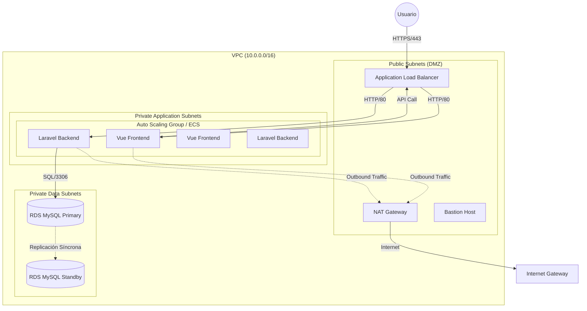

# ☁️ Arquitectura Escalable en AWS

## 🎯 Visión General

Este documento detalla el diseño de la infraestructura en Amazon Web Services (AWS) para soportar el despliegue en producción de la aplicación e-commerce (Vue + Laravel). La arquitectura prioriza la alta disponibilidad, la seguridad mediante aislamiento de red y la capacidad de escalado horizontal.

---

## 📐 Diagrama de Arquitectura

---

## 1️⃣ Red (VPC)

Hemos diseñado una **Virtual Private Cloud (VPC)** propia con el rango CIDR `10.0.0.0/16` para tener control total sobre la segmentación de red.

### Segmentación de Subredes

| Tipo          | CIDR          | Zona de Disponibilidad (AZ) | Propósito                           | Acceso Internet         |
|---------------|---------------|-----------------------------|-------------------------------------|-------------------------|
| **Pública**   | `10.0.1.0/24` | eu-west-1a                  | Load Balancer, NAT Gateway, Bastion | Sí (IGW)                |
| **Pública**   | `10.0.2.0/24` | eu-west-1b                  | Alta Disponibilidad LB              | Sí (IGW)                |
| **Privada App** | `10.0.3.0/24` | eu-west-1a                  | Contenedores Vue/Laravel            | Solo salida (vía NAT)   |
| **Privada App** | `10.0.4.0/24` | eu-west-1b                  | Réplicas Contenedores               | Solo salida (vía NAT)   |
| **Privada Datos** | `10.0.5.0/24` | eu-west-1a                  | RDS MySQL (Primary)                 | No                      |
| **Privada Datos** | `10.0.6.0/24` | eu-west-1b                  | RDS MySQL (Standby)                 | No                      |

### Justificación del Diseño

- **VPC Propia**: Aislamiento total de otros proyectos o servicios por defecto.
- **NAT Gateway**: Permite que los servidores de aplicación privados descarguen actualizaciones o paquetes (Composer/NPM) sin ser accesibles desde Internet.
- **Distribución por AZ**: El uso de `eu-west-1a` y `eu-west-1b` garantiza que si un Centro de Datos (AZ) cae físicamente, la aplicación sigue funcionando en el otro.

---

## 2️⃣ Capa de Entrada (Edge)

El único punto de entrada de tráfico es un **Application Load Balancer (ALB)**.

- **Función**: Distribuye el tráfico entrante entre las instancias/contenedores.
- **Terminación HTTPS**: El ALB gestiona el certificado SSL (AWS Certificate Manager), descargando este trabajo de los servidores de aplicación.
- **Enrutamiento**:
  - `api.AlberoPerezTech.ddaw.es` → Target Group Backend (Puerto 8002)
  - `AlberoPerezTech.ddaw.es` → Target Group Frontend (Puerto 8001)

---

## 3️⃣ Capa de Aplicación (Compute)

Utilizamos **Amazon ECS (Elastic Container Service)** o un **Auto Scaling Group (EC2)** con Docker.

- **Alta Disponibilidad**: Mínimo 2 instancias, una en cada AZ.
- **Escalabilidad**:
  - Si la CPU > 70%, se lanza una nueva instancia automáticamente.
  - Si el tráfico baja, se eliminan instancias para ahorrar costes.
- **Contenedorización**: Los mismos contenedores de Desarrollo se utilizan en Producción, garantizando consistencia.

---

## 4️⃣ Capa de Datos

Utilizamos **Amazon RDS (Relational Database Service)** para MySQL.

- **Multi-AZ**: Activada. AWS mantiene una réplica en espera ("Standby") en otra AZ. Si la primaria falla, el DNS de RDS apunta automáticamente a la réplica.
- **Aislamiento**: Situada en las "Private Data Subnets", sin ninguna ruta hacia Internet.
- **Backup**: Snapshots automáticos diarios con retención de 7 días.

---

## 5️⃣ Seguridad (Security Groups)

Implementamos una estrategia de "Defensa en Profundidad" mediante Security Groups (firewalls virtuales):

### 🛡️ SG-ALB (Load Balancer)
- **Inbound**: 443 (HTTPS) desde `0.0.0.0/0` (Cualquier lugar).
- **Outbound**: Todo el tráfico hacia `SG-App`.

### 🛡️ SG-App (Aplicación)
- **Inbound**: Puerto 8001/8002 **SOLO** desde `SG-ALB`.
- **Inbound**: Puerto 22 (SSH) **SOLO** desde la IP de la VPN corporativa o Bastion Host.
- **Outbound**: Todo (para conectar a BD e Internet vía NAT).

### 🛡️ SG-Datos (Base de Datos)
- **Inbound**: Puerto 3306 (MySQL) **SOLO** desde `SG-App`.
- **Outbound**: Ninguno.

---

## ✅ Resumen de Beneficios

1. **Seguridad**: La Base de Datos es inaccesible desde Internet. A la aplicación solo se puede acceder a través del Load Balancer.
2. **Resiliencia**: La pérdida de un datacenter completo (AZ) no detiene el servicio (gracias a Multi-AZ y Auto Scaling).
3. **Mantenibilidad**: El uso de servicios gestionados (RDS, ALB, NAT) reduce la carga de administración de sistemas.
