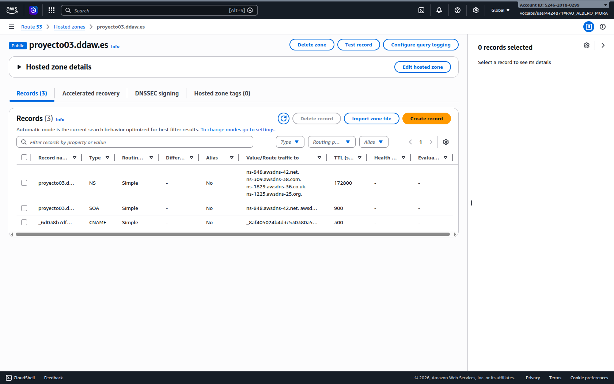
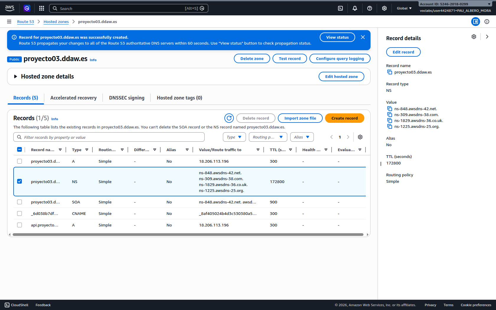
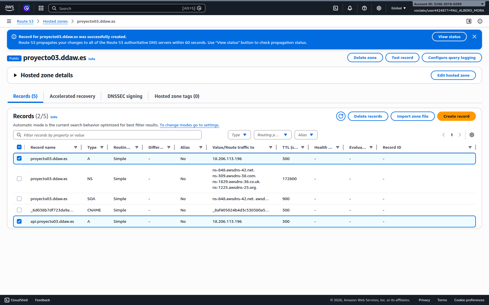
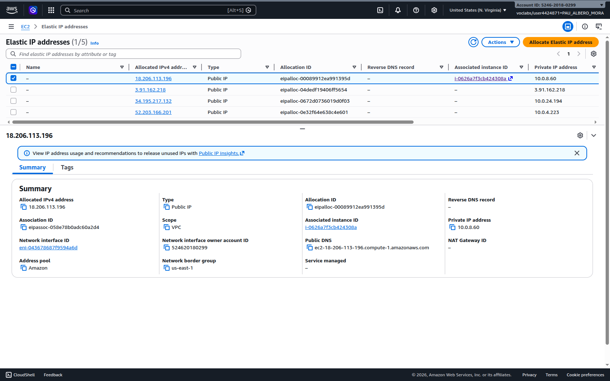

# 🌐 DNS del proyecto (Route 53) — `proyecto03.ddaw.es`

## 🎯 Objetivo

Publicar el frontend y el backend en producción con un dominio propio del proyecto, cumpliendo el requisito de:

- Servidor/servicio DNS máster en la nube.
- Creación de la zona `proyecto03.ddaw.es`.
- Registros mínimos para publicar aplicaciones.
- Datos necesarios para la delegación desde el DNS padre (`ddaw.es`).

## 🧩 Servicio DNS máster

La zona DNS se gestiona en **AWS Route 53** mediante una **Hosted Zone pública**.

- **Hosted Zone**: `proyecto03.ddaw.es`
- **Proveedor**: AWS Route 53

## 🧾 Nameservers (NS) para delegación

Para que el dominio `proyecto03.ddaw.es` sea resoluble desde Internet, el administrador del DNS padre (`ddaw.es`) debe **delegar** la zona creando un registro **NS** hacia los siguientes nameservers:

- `ns-848.awsdns-42.net.`
- `ns-309.awsdns-38.com.`
- `ns-1829.awsdns-36.co.uk.`
- `ns-1225.awsdns-25.org.`

### Estado de la delegación

- **Pendiente**: si el DNS padre (`ddaw.es`) no está operativo o no se ha realizado la delegación, la zona existe en Route 53 pero **no quedará vinculada** públicamente.

## 📌 Registros DNS mínimos para publicar las aplicaciones

### Infraestructura

- **Servidor**: AWS EC2
- **IP elástica**: `18.206.113.196`

### Registros recomendados

En la zona `proyecto03.ddaw.es` se deben definir como mínimo:

- **A** (root)
  - **Nombre**: `proyecto03.ddaw.es` (registro raíz)
  - **Valor**: `18.206.113.196`

- **A** (API)
  - **Nombre**: `api.proyecto03.ddaw.es`
  - **Valor**: `18.206.113.196`

Opcionales:

- **A** (www)
  - **Nombre**: `www.proyecto03.ddaw.es`
  - **Valor**: `18.206.113.196`

- **A** (n8n)
  - **Nombre**: `n8n.proyecto03.ddaw.es`
  - **Valor**: `18.206.113.196`

## 🔐 HTTPS (Let’s Encrypt)

Una vez:

- la delegación esté aplicada en el DNS padre, y
- los registros `A` apunten a la EC2,

se pueden emitir certificados válidos (Let’s Encrypt) para:

- `proyecto03.ddaw.es`
- `api.proyecto03.ddaw.es`

La terminación HTTPS y renovación se realiza mediante el script del proyecto:

- `deploy/nginx/setup_prod.sh`

## 🧪 Verificación

Cuando la delegación esté activa, se debe poder comprobar:

- `proyecto03.ddaw.es` resuelve a `18.206.113.196`
- `api.proyecto03.ddaw.es` resuelve a `18.206.113.196`

### Acceso mientras el DNS no está delegado

Si el DNS padre (`ddaw.es`) aún no ha delegado la zona, puedes acceder directamente por IP elástica:

- **Frontend**: `http://18.206.113.196` (o `https://18.206.113.196` si ya tienes certificado SSL por IP)
- **API**: `http://18.206.113.196:8000/api/products` (o `https://18.206.113.196:8000/api/products` si tienes SSL por IP)

**Una vez delegado el DNS**:
- **Frontend**: `https://proyecto03.ddaw.es`
- **API**: `https://api.proyecto03.ddaw.es/api/products`

## 📷 Evidencias

Para que este apartado quede verificable en la entrega, pásame estas capturas (formato **PNG/JPG**) y las añadiré al repositorio en `docs/imagenes/` con estos nombres.

### 1) Zona DNS en Route 53 (creación + NS)

- **Captura**: AWS Console → Route 53 → Hosted zones → `proyecto03.ddaw.es` (vista donde se vea el nombre de la zona y la lista de registros).
- **Nombre de archivo**: `docs/imagenes/dns_route53_hosted_zone_proyecto03.png`

### 2) Registro NS (nameservers) visible

- **Captura**: dentro de la misma Hosted Zone, fila del registro `NS` donde se vean los 4 nameservers.
- **Nombre de archivo**: `docs/imagenes/dns_route53_ns_records.png`

### 3) Registros A de publicación (root + api)

- **Captura**: lista de records donde se vean los `A` para:
  - `proyecto03.ddaw.es` → `18.206.113.196`
  - `api.proyecto03.ddaw.es` → `18.206.113.196`
- **Nombre de archivo**: `docs/imagenes/dns_route53_a_records_root_api.png`

### 4) Evidencia de IP elástica en EC2

- **Captura**: AWS Console → EC2 → Elastic IPs donde se vea la IP `18.206.113.196` y que está asociada a tu instancia.
- **Nombre de archivo**: `docs/imagenes/ec2_elastic_ip_18_206_113_196.png`

