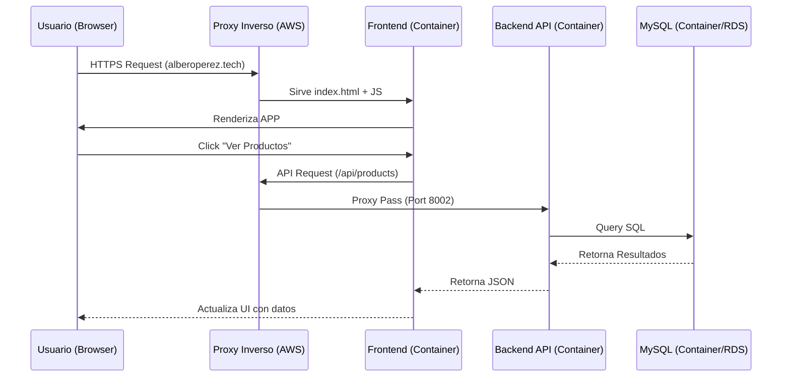

# 🌐 Visión Global del Sistema

Este documento describe la arquitectura global de la tienda en línea "AlberoPerezTech", integrando todos los componentes (Frontend, Backend, BBDD, Infraestructura) para ofrecer una visión de conjunto del funcionamiento técnico.

## 🏗️ Componentes Principales

El sistema se compone de 4 bloques fundamentales que interactúan entre sí:

1. **Frontend (Vue.js SPA)**: La interfaz de usuario accesible desde el navegador.
2. **Backend (Laravel API)**: El cerebro, gestiona la lógica de negocio y seguridad.
3. **Base de Datos (MySQL)**: Almacenamiento persistente de la información.
4. **Infraestructura (AWS)**: Servidores y redes donde se ejecuta todo.

## 🔄 Flujo de Datos (Data Flow)

## 🔐 Seguridad Transversal

### 1. HTTPS con Let's Encrypt
Todas las comunicaciones externas están cifradas con TLS/SSL. Los certificados se renuevan automáticamente vía Certbot en el servidor Nginx (Host).

### 2. CORS y Sanctum
El frontend y el backend están en subdominios diferentes (`www` vs `api`).
- **CORS**: El backend sólo acepta peticiones de orígenes confiables (`FRONTEND_URL`).
- **Sanctum**: Utiliza cookies `httpOnly` y `SameSite=Lax` para mantener la sesión sin exponer tokens al JavaScript (previene ataques XSS).

### 3. Aislamiento de Red
La base de datos no es accesible directamente desde Internet. Sólo el contenedor del Backend puede hablar con ella (ver `docker-compose.prod.yml` y reglas de red).

## 🌍 Entornos: Desarrollo vs Producción

El sistema está diseñado para ejecutarse de forma idéntica en local y en la nube gracias a Docker, pero con configuraciones adaptadas:

| Componente | Desarrollo (Local) | Producción (AWS) |
|------------|--------------------|------------------|
| **Dominio** | `localhost` | `AlberoPerezTech.ddaw.es` |
| **Puerto Front** | 5173 | 8001 (interno) -> 443 (público) |
| **Puerto Back** | 8000 | 8002 (interno) -> 443 (público) |
| **SSL** | No (HTTP) | Sí (HTTPS) |
| **BD Access** | Directo (3308) | Bloqueado (sólo interno) |

## 📦 Sistema de Despliegue

Utilizamos una estrategia de **Repositorios Independientes con Monorepo Virtual**:
- Aunque el código está en un solo repositorio Git, tratamos `frontend/` y `laravel/` como proyectos separados con ciclos de vida propios.
- Esto permite actualizar el frontend sin tocar el backend, y viceversa, mejorando la mantenibilidad y reduciendo riesgos en los despliegues.
