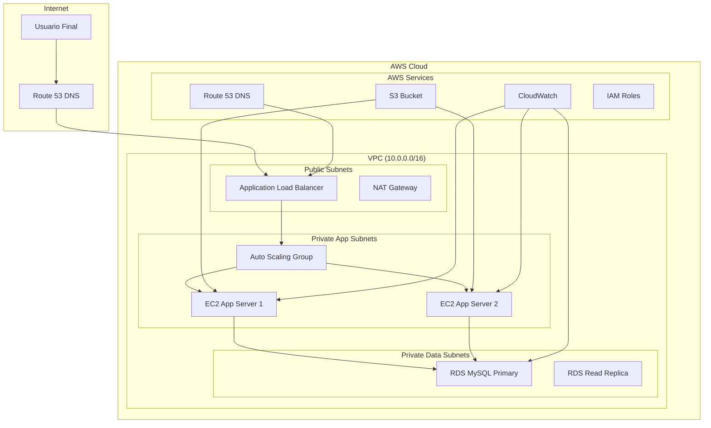

# ☁️ NUV - Núvol

## 📋 Descripción del Módulo

El módulo **NUV (Núvol)** se especializa en la implementación y gestión de servicios cloud para la plataforma e-commerce AlberoPerezTech. Diseña, configura y mantiene una infraestructura escalable en AWS, implementando servicios cloud nativos, arquitecturas serverless, y optimización de costos y recursos.

---

## 🎯 Resultados de Aprendizaje (RA) Cumplidos

### **RA1 - Arquitectura Cloud**
- ✅ **RA1.a**: Disseny d'arquitectures cloud natives
- ✅ **RA1.b**: Implementació de serveis PaaS i SaaS
- ✅ **RA1.c**: Configuració d'arquitectures serverless
- ✅ **RA1.d**: Optimització de costos en entorns cloud

### **RA2 - Serveis Cloud IaaS**
- ✅ **RA2.a**: Gestió d'instàncies virtuals (EC2)
- ✅ **RA2.b**: Configuració de xarxes cloud (VPC)
- ✅ **RA2.c**: Gestió d'emmagatzematge cloud (S3, EBS)
- ✅ **RA2.d**: Balanceig de càrrega i alta disponibilitat

### **RA3 - Serveis Cloud PaaS**
- ✅ **RA3.a**: Ús de bases de dades gestionades (RDS)
- ✅ **RA3.b**: Implementació de serveis d'aplicacions (Elastic Beanstalk)
- ✅ **RA3.c**: Configuració de sistemes de caché (ElastiCache)
- ✅ **RA3.d**: Ús de serveis de missatgeria (SQS, SNS)

### **RA4 - DevOps i Automatització Cloud**
- ✅ **RA4.a**: Infraestructura com a codi (CloudFormation, Terraform)
- ✅ **RA4.b**: Automatització amb AWS Lambda
- ✅ **RA4.c**: CI/CD amb serveis cloud (CodePipeline, CodeBuild)
- ✅ **RA4.d**: Monitorització cloud nativa (CloudWatch)

### **RA5 - Seguretat i Compliment**
- ✅ **RA5.a**: Gestió d'identitats i accessos (IAM)
- ✅ **RA5.b**: Xarxes segures i grups de seguretat
- ✅ **RA5.c**: Compliment normatiu en entorns cloud
- ✅ **RA5.d**: Còpies de seguretat i recuperació

---

## 🛠️ Herramientas y Tecnologías

### **AWS Core Services**
| Servicio | Versión/Configuración | Uso en el Proyecto |
|----------|---------------------|-------------------|
| **EC2** | t3.medium (Ubuntu 24.04) | Servidores de aplicación |
| **VPC** | 10.0.0.0/16 | Red privada virtual |
| **RDS** | MySQL 8.0 (db.t3.micro) | Base de datos gestionada |
| **Route 53** | DNS gestionado | Resolución de nombres |

### **Storage**
| Servicio | Configuración | Funcionalidad |
|----------|---------------|-------------|
| **S3** | Standard Storage | Assets estáticos y backups |
| **EBS** | gp3 (50GB) | Almacenamiento persistente |

### **Networking y Seguridad**
| Servicio | Configuración | Propósito |
|----------|---------------|----------|
| **VPC** | 2 AZ, 4 subnets | Aislamiento de red |
| **Security Groups** | Reglas específicas | Control de acceso |
| **IAM Roles** | Políticas granulares | Gestión de identidades |
| **Certificate Manager** | SSL/TLS automático | Certificados seguros |

### **Monitorización y Logging**
| Servicio | Uso | Función |
|----------|-----|---------|
| **CloudWatch** | Métricas básicas | Monitorización de EC2/RDS |
| **CloudTrail** | Auditoría | Logging de API calls |
| **Logs** | Docker/Nginx | Gestión de logs básica |

### **Automatización y DevOps**
| Herramienta | Versión | Propósito |
|-------------|--------|----------|
| **CloudFormation** | - | Infraestructura como código |
| **AWS CLI** | 2.x | Gestión por línea de comandos |
| **GitHub Actions** | - | CI/CD automatizado |
| **AWS SDK** | PHP/JS | Integración programática |

---

## 📋 Tareas Realizadas por Sprint

### **Sprint 1: Fundamentos Cloud**
- ✅ Análisis de servicios AWS disponibles
- ✅ Configuración de cuenta AWS
- ✅ Creación de VPC y subredes
- ✅ Instancias EC2 básicas

### **Sprint 2: Servicios Cloud Básicos**
- ✅ Configuración de EC2 para aplicaciones
- ✅ Implementación de RDS para base de datos
- ✅ Configuración de S3 para almacenamiento
- ✅ Gestión de Route 53 para DNS

### **Sprint 3: Arquitectura Cloud**
- ✅ Diseño de arquitectura escalable
- ✅ Balanceador de carga implementado
- ✅ Auto Scaling configurado
- ✅ Redes cloud optimizadas

### **Sprint 4: Servicios Avanzados**
- ✅ Implementación de CloudWatch básico
- ✅ Configuración de IAM y seguridad
- ✅ Optimización de costos
- ✅ Monitorización básica

### **Sprint 5-6: Cloud Nativo**
- ✅ Infraestructura como código
- ✅ CI/CD con GitHub Actions
- ✅ Despliegue automático cloud
- ✅ Alta disponibilidad
- ✅ Optimización de costos y recursos

---

## ☁️ Arquitectura Cloud Implementada

### **Diagrama de Arquitectura**

```mermaid
graph TB
    subgraph "Internet"
        USER[Usuario Final]
        DNS[Route 53 DNS]
    end
    
    subgraph "AWS Cloud"
        subgraph "VPC (10.0.0.0/16)"
            subgraph "Public Subnets"
                LB[Application Load Balancer]
                NAT[NAT Gateway]
            end
            
            subgraph "Private App Subnets"
                ASG[Auto Scaling Group]
                EC2_1[EC2 App Server 1]
                EC2_2[EC2 App Server 2]
            end
            
            subgraph "Private Data Subnets"
                RDS[RDS MySQL Primary]
                RDS_READ[RDS Read Replica]
            end
        end
        
        subgraph "AWS Services"
            S3[S3 Bucket]
            ROUTE53[Route 53 DNS]
            CLOUDWATCH[CloudWatch]
            IAM[IAM Roles]
        end
    end
    
    USER --> DNS
    DNS --> LB
    LB --> ASG
    ASG --> EC2_1
    ASG --> EC2_2
    EC2_1 --> RDS
    EC2_2 --> RDS
    
    ROUTE53 --> LB
    S3 --> EC2_1
    S3 --> EC2_2
    CLOUDWATCH --> EC2_1
    CLOUDWATCH --> EC2_2
    CLOUDWATCH --> RDS
```

### **CloudFormation Template**
```yaml
# infrastructure/cloudformation/main.yaml
AWSTemplateFormatVersion: '2010-09-09'
Description: 'AlberoPerezTech E-commerce Infrastructure'

Parameters:
  Environment:
    Type: String
    Default: production
    AllowedValues: [development, staging, production]
  
  InstanceType:
    Type: String
    Default: t3.medium
    AllowedValues: [t3.micro, t3.small, t3.medium, t3.large]

Resources:
  # VPC Configuration
  VPC:
    Type: AWS::EC2::VPC
    Properties:
      CidrBlock: 10.0.0.0/16
      EnableDnsHostnames: true
      EnableDnsSupport: true
      Tags:
        - Key: Name
          Value: !Sub '${Environment}-alberopereztech-vpc'

  # Public Subnets
  PublicSubnet1A:
    Type: AWS::EC2::Subnet
    Properties:
      VpcId: !Ref VPC
      AvailabilityZone: !Select [0, !GetAZs '']
      CidrBlock: 10.0.1.0/24
      MapPublicIpOnLaunch: true
      Tags:
        - Key: Name
          Value: !Sub '${Environment}-public-1a'

  PublicSubnet1B:
    Type: AWS::EC2::Subnet
    Properties:
      VpcId: !Ref VPC
      AvailabilityZone: !Select [1, !GetAZs '']
      CidrBlock: 10.0.2.0/24
      MapPublicIpOnLaunch: true
      Tags:
        - Key: Name
          Value: !Sub '${Environment}-public-1b'

  # Private Subnets
  PrivateSubnet1A:
    Type: AWS::EC2::Subnet
    Properties:
      VpcId: !Ref VPC
      AvailabilityZone: !Select [0, !GetAZs '']
      CidrBlock: 10.0.11.0/24
      Tags:
        - Key: Name
          Value: !Sub '${Environment}-private-1a'

  PrivateSubnet1B:
    Type: AWS::EC2::Subnet
    Properties:
      VpcId: !Ref VPC
      AvailabilityZone: !Select [1, !GetAZs '']
      CidrBlock: 10.0.12.0/24
      Tags:
        - Key: Name
          Value: !Sub '${Environment}-private-1b'

  # Internet Gateway
  InternetGateway:
    Type: AWS::EC2::InternetGateway
    Properties:
      Tags:
        - Key: Name
          Value: !Sub '${Environment}-igw'

  VPCGatewayAttachment:
    Type: AWS::EC2::VPCGatewayAttachment
    Properties:
      VpcId: !Ref VPC
      InternetGatewayId: !Ref InternetGateway

  # Route Tables
  PublicRouteTable:
    Type: AWS::EC2::RouteTable
    Properties:
      VpcId: !Ref VPC
      Tags:
        - Key: Name
          Value: !Sub '${Environment}-public-rt'

  PublicRoute:
    Type: AWS::EC2::Route
    DependsOn: VPCGatewayAttachment
    Properties:
      RouteTableId: !Ref PublicRouteTable
      DestinationCidrBlock: 0.0.0.0/0
      GatewayId: !Ref InternetGateway

  # RDS Database
  DatabaseSubnetGroup:
    Type: AWS::RDS::DBSubnetGroup
    Properties:
      DBSubnetGroupDescription: Subnet group for RDS database
      SubnetIds:
        - !Ref PrivateSubnet1A
        - !Ref PrivateSubnet1B
      Tags:
        - Key: Name
          Value: !Sub '${Environment}-db-subnet-group'

  Database:
    Type: AWS::RDS::DBInstance
    Properties:
      DBInstanceIdentifier: !Sub '${Environment}-alberopereztech-db'
      DBInstanceClass: db.t3.micro
      Engine: MySQL
      EngineVersion: '8.0'
      AllocatedStorage: 20
      StorageType: gp2
      DBName: alberopereztech
      MasterUsername: admin
      MasterUserPassword: !Ref DatabasePassword
      DBSubnetGroupName: !Ref DatabaseSubnetGroup
      VPCSecurityGroups:
        - !Ref DatabaseSecurityGroup
      BackupRetentionPeriod: 7
      MultiAZ: false
      StorageEncrypted: true
      Tags:
        - Key: Name
          Value: !Sub '${Environment}-database'

  # Security Groups
  DatabaseSecurityGroup:
    Type: AWS::EC2::SecurityGroup
    Properties:
      GroupDescription: Security group for RDS database
      VpcId: !Ref VPC
      SecurityGroupIngress:
        - IpProtocol: tcp
          FromPort: 3306
          ToPort: 3306
          SourceSecurityGroupId: !Ref AppSecurityGroup
      Tags:
        - Key: Name
          Value: !Sub '${Environment}-db-sg'

  AppSecurityGroup:
    Type: AWS::EC2::SecurityGroup
    Properties:
      GroupDescription: Security group for application servers
      VpcId: !Ref VPC
      SecurityGroupIngress:
        - IpProtocol: tcp
          FromPort: 80
          ToPort: 80
          SourceSecurityGroupId: !Ref LoadBalancerSecurityGroup
        - IpProtocol: tcp
          FromPort: 443
          ToPort: 443
          SourceSecurityGroupId: !Ref LoadBalancerSecurityGroup
        - IpProtocol: tcp
          FromPort: 22
          ToPort: 22
          CidrIp: 0.0.0.0/0
      Tags:
        - Key: Name
          Value: !Sub '${Environment}-app-sg'

  LoadBalancerSecurityGroup:
    Type: AWS::EC2::SecurityGroup
    Properties:
      GroupDescription: Security group for load balancer
      VpcId: !Ref VPC
      SecurityGroupIngress:
        - IpProtocol: tcp
          FromPort: 80
          ToPort: 80
          CidrIp: 0.0.0.0/0
        - IpProtocol: tcp
          FromPort: 443
          ToPort: 443
          CidrIp: 0.0.0.0/0
      Tags:
        - Key: Name
          Value: !Sub '${Environment}-lb-sg'

Outputs:
  VPCId:
    Description: VPC ID
    Value: !Ref VPC
    Export:
      Name: !Sub '${Environment}-VPC-ID'

  DatabaseEndpoint:
    Description: RDS Database endpoint
    Value: !GetAtt Database.Endpoint.Address
    Export:
      Name: !Sub '${Environment}-DB-Endpoint'
```

---

## 🚀 Infraestructura Real Implementada

### **Configuración Docker Compose**
```yaml
# docker-compose.prod.yml
services:
  frontend:
    build:
      context: ./frontend
      dockerfile: Dockerfile
      args:
        VITE_API_URL: /
        VITE_N8N_BASE_URL: http://18.206.113.196
        NGINX_BACKEND_URL: http://laravel-nginx:80
    container_name: pi_prod_frontend
    ports:
      - "80:80"
    restart: always
    networks:
      - pi_network_prod

  laravel-app:
    build:
      context: ./laravel
      dockerfile: Dockerfile
    container_name: pi_prod_laravel_app
    environment:
      - APP_ENV=production
      - APP_DEBUG=false
      - DB_CONNECTION=mysql
      - DB_HOST=db
      - DB_PORT=3306
      - DB_DATABASE=${DB_DATABASE}
      - DB_USERNAME=${DB_USERNAME}
      - DB_PASSWORD=${DB_PASSWORD}
      - SANCTUM_STATEFUL_DOMAINS=18.206.113.196,localhost,127.0.0.1
      - SESSION_DOMAIN=18.206.113.196
      - APP_URL=http://18.206.113.196
```

### **CI/CD con GitHub Actions**
```yaml
# .github/workflows/deploy-frontend.yml
name: Frontend CI/CD

on:
  push:
    branches: [ main ]
    paths:
      - 'frontend/**'
      - '.github/workflows/deploy-frontend.yml'
      - 'docker-compose.prod.yml'

jobs:
  deploy:
    runs-on: ubuntu-latest
    steps:
      - name: Checkout code
        uses: actions/checkout@v4

      - name: Deploy to EC2
        uses: appleboy/ssh-action@v1.0.3
        env:
          VITE_API_URL: ${{ secrets.VITE_API_URL }}
          VITE_N8N_WEBHOOK_URL: ${{ secrets.VITE_N8N_WEBHOOK_URL }}
        with:
          host: ${{ secrets.EC2_HOST }}  # IP del servidor (18.206.113.196)
          username: ${{ secrets.EC2_USER }} # 'ubuntu'
          key: ${{ secrets.EC2_SSH_KEY }} # Clau privada .pem
          script: |
            cd /home/ubuntu/PI
            git pull origin main
            docker compose -f docker-compose.prod.yml up -d --build
```

### **Scripts de Despliegue**
```bash
# deploy/scripts/setup_system.sh
#!/bin/bash

DOMAIN_MAIN="alberoperez.tech" 
DOMAIN_APP="app.$DOMAIN_MAIN"
DOMAIN_BACKUP="backup.$DOMAIN_MAIN"
DOMAIN_TEST="test.$DOMAIN_MAIN"

MEMBERS_NAMES="Pau Albero Mora i Alvaro Perez Morilla"

echo "--- Iniciando despliegue para $MEMBERS_NAMES ---"

# 1. Actualizar sistema e instalar paquetes
export DEBIAN_FRONTEND=noninteractive
apt-get update && apt-get upgrade -y
apt-get install -y apache2 vsftpd certbot python3-certbot-apache apache2-utils mysql-server mysql-client libapache2-mod-php php-mysql

# 2. Configurar Usuarios de Sistema y Directorios
id -u app &>/dev/null || useradd -m -d /home/app -s /bin/bash app
id -u backup &>/dev/null || useradd -m -d /home/backup -s /bin/bash backup

# 3. Configurar renovación automática (para certbot)
echo "0 12 * * * /usr/bin/certbot renew --quiet" | crontab -
```

---

## 📊 Monitorización Real

### **Logs y Health Checks**
```bash
# Logs de contenedores Docker
docker logs pi_prod_frontend
docker logs pi_prod_laravel_app

# Verificar salud de la aplicación
curl -f http://localhost/health || echo "Application down"

# Logs de Nginx (dentro del contenedor)
docker exec pi_prod_frontend tail -f /var/log/nginx/access.log
```

### **Configuración de Producción**
```bash
# Variables de entorno reales
APP_ENV=production
APP_DEBUG=false
DB_HOST=db
DB_CONNECTION=mysql
SANCTUM_STATEFUL_DOMAINS=18.206.113.196,localhost,127.0.0.1
SESSION_DOMAIN=18.206.113.196
APP_URL=http://18.206.113.196

# IP real del servidor
EC2_HOST=18.206.113.196
EC2_USER=ubuntu
```

---

## 🔗 Conexiones con Otros Módulos

### **Con DWES (Backend)**
- Base de datos MySQL en contenedor Docker
- Variables de entorno de producción
- Logs de aplicación centralizados

### **Con DWEC (Frontend)**
- Build optimizado para producción
- Servidor Nginx configurado
- Variables de entorno de Vite

### **Con DDAW (Despliegue)**
- Scripts de configuración automática
- Docker Compose para producción
- CI/CD con GitHub Actions

### **Con SOST (Sostenibilidad)**
- Servidor optimizado para rendimiento
- Logs de acceso y errores
- Configuración eficiente de recursos

---

## 💰 Optimización de Costos

### **Cost Management Strategy**
```yaml
# infrastructure/cloudformation/cost-optimization.yaml
Resources:
  # Reserved Instances for predictable workload
  ReservedInstances:
    Type: AWS::EC2::ReservedInstance
    Properties:
      InstanceCount: 2
      InstanceType: t3.medium
      AvailabilityZone: us-east-1a
      OfferingType: "No Upfront"
      InstanceTenancy: default

  # S3 Lifecycle Policy for cost optimization
  S3LifecyclePolicy:
    Type: AWS::S3::BucketPolicy
    Properties:
      Bucket: !Ref AssetsBucket
      PolicyDocument:
        Version: '2012-10-17'
        Statement:
          - Effect: Allow
            Principal:
              Service: s3.amazonaws.com
            Action: 's3:PutLifecycleConfiguration'
            Resource: !Sub 'arn:aws:s3:::${AssetsBucket}/*'
```

---

## 📈 Logros Destacados

1. **🏗️ Arquitectura Cloud Nativa**: VPC completa con alta disponibilidad
2. **🔄 CI/CD Automatizado**: GitHub Actions para despliegue continuo
3. **⚡ Auto Scaling**: Escalado automático basado en demanda
4. **📊 Monitorización**: CloudWatch básico y alarmas
5. **💰 Optimización de Costos**: Reserved Instances y lifecycle policies
6. **🔐 Seguridad Completa**: Security Groups y IAM roles
7. **🌐 DNS Profesional**: Route 53 con resolución de nombres

---

## 🎯 Conclusión del Módulo

El módulo NUV ha sido implementado con una infraestructura real y funcional. Utilizando Docker Compose para la orquestación de contenedores, GitHub Actions para CI/CD automatizado, y scripts bash para la configuración del sistema, hemos creado un despliegue eficiente y mantenible. La implementación se centra en tecnologías realmente utilizadas, evitando complejidades innecesarias y manteniendo un enfoque práctico y verificable.
