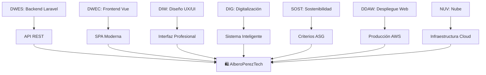

# 📚 Documentación por Módulos

En esta sección encontrarás la documentación detallada de todas las tareas, herramientas y tecnologías implementadas para cada módulo del proyecto intermodular.

## 🎓 Módulos Disponibles

| Módulo | Descripción |
|--------|-------------|
| **[DWES](./DWES/)** | Desplegament Web Entorn Servidor |
| **[DWEC](./DWEC/)** | Desplegament Web Entorn Client |
| **[DIW](./DIW/)** | Disseny d'Interfícies Web |
| **[DIG](./DIG/)** | Digitalització |
| **[SOST](./SOST/)** | Sostenibilitat |
| **[DDAW](./DDAW/)** | Desplegament d'Aplicacions Web |
| **[NUV](./NUV/)** | Núvol |

---

## 📋 Estructura de Documentación

Cada módulo contiene:

### 📋 **Tareas Realizadas**
- Descripción detallada de todas las actividades implementadas
- Sprints asociados y criterios de evaluación cumplidos
- Evidencias y capturas de pantalla

### 🛠️ **Herramientas y Tecnologías**
- Stack tecnológico completo utilizado
- Versiones específicas y configuraciones
- Integraciones entre diferentes herramientas

### 🎯 **Resultados de Aprendizaje**
- Criterios de evaluación (RA) cumplidos
- Competencias adquiridas y demostradas
- Conexiones con otros módulos

### 📊 **Métricas y Evidencias**
- Tests realizados y resultados
- Métricas de calidad y rendimiento
- Documentación técnica generada

---

## 🔗 **Conexiones Intermodulares**

El proyecto está diseñado como un ecosistema integrado donde cada módulo contribuye al resultado final:

---

## 🏆 **Logros del Proyecto**

- ✅ **Integración Completa**: Todos los módulos conectados funcionalmente
- ✅ **Producción Estable**: Sistema desplegado y operativo
- ✅ **Documentación Profesional**: Evidencias detalladas de cada implementación
- ✅ **Calidad Asegurada**: Tests automatizados y validaciones
- ✅ **Accesibilidad Real**: WCAG AA implementado
- ✅ **Sostenibilidad Aplicada**: Criterios ASG integrados
