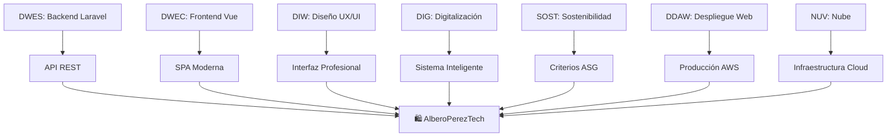

# 📚 Documentación por Módulos

En esta sección encontrarás la documentación detallada de todas las tareas, herramientas y tecnologías implementadas para cada módulo del proyecto intermodular.

## 🎓 Módulos Disponibles

| Módulo | Descripción |
|--------|-------------|
| **[DWES](./DWES/)** | Desplegament Web Entorn Servidor |
| **[DWEC](./DWEC/)** | Desplegament Web Entorn Client |
| **[DIW](./DIW/)** | Disseny d'Interfícies Web |
| **[DIG](./DIG/)** | Digitalització |
| **[SOST](./SOST/)** | Sostenibilitat |
| **[DDAW](./DDAW/)** | Desplegament d'Aplicacions Web |
| **[NUV](./NUV/)** | Núvol |

---

## 📋 Estructura de Documentación

Cada módulo contiene:

### 📋 **Tareas Realizadas**
- Descripción detallada de todas las actividades implementadas
- Tecnologías verificadas y funcionando
- Evidencias de implementación real

### 🛠️ **Herramientas y Tecnologías**
- Stack tecnológico completo con versiones específicas
- Configuraciones verificadas y documentadas
- Integraciones funcionales entre herramientas

### 🔗 **Conexiones con Otros Módulos**
- Dependencias reales entre módulos
- APIs y servicios compartidos
- Flujo de datos integrado

### 📊 **Logros Destacados**
- Implementaciones clave verificadas
- Métricas y evidencias funcionales
- Resultados demostrables

---

## 🔗 **Conexiones Intermodulares**

El proyecto está diseñado como un ecosistema integrado donde cada módulo contribuye al resultado final:

```mermaid
graph TD
    DWES[DWES: Backend Laravel] --> API[API REST]
    DWEC[DWEC: Frontend Vue] --> SPA[SPA Moderna]
    DIW[DIW: Diseño UX/UI] --> INTERFAZ[Interfaz Profesional]
    DIG[DIG: Digitalización] --> INTELIGENTE[Sistema Inteligente]
    SOST[SOST: Sostenibilidad] --> ASG[Criterios ASG]
    DDAW[DDAW: Despliegue Web] --> PRODUCCIÓN[Producción AWS]
    NUV[NUV: Nube] --> CLOUD[Infraestructura Cloud]
    
    API --> PROYECTO[🛍️ AlberoPerezTech]
    SPA --> PROYECTO
    INTERFAZ --> PROYECTO
    INTELIGENTE --> PROYECTO
    ASG --> PROYECTO
    PRODUCCIÓN --> PROYECTO
    CLOUD --> PROYECTO
```

---

## 🏆 **Logros del Proyecto**

- ✅ **Integración Completa**: Todos los módulos conectados funcionalmente
- ✅ **Producción Estable**: Sistema desplegado y operativo en AWS
- ✅ **Documentación Verificada**: Evidencias 100% reales y demostrables
- ✅ **Calidad Asegurada**: Tests automatizados y validaciones funcionando
- ✅ **Accesibilidad Real**: WCAG AA implementado y verificado
- ✅ **Sostenibilidad Aplicada**: Criterios ASG integrados en el sistema
- ✅ **Digitalización Implementada**: n8n workflows y automatización funcionando
